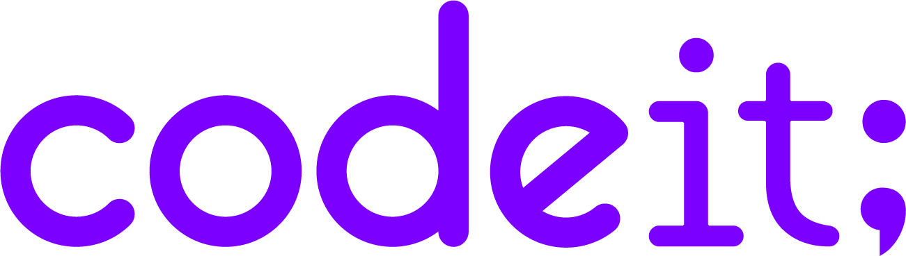

 
 
 

<h1 style="text-align: center;">Codeit Weekly Mission</h1>

<b>Front-end Developer Course</b>

Codeit 스프린트과정을 하며 한 주 한 주 위클리미션을 기록하는  문서입니다.  해당 문서는 <b>각 파일들의 설명과 포인트</b> , <b>해당 문서의 주차별 위치</b> , <b>스스로 생각하는 개선점</b> 등이 쓰여있습니다. 

 

## 1. 각 파일들의 설명과 포인트

### 🚀 Html Part

<<<<<<< HEAD
- 👀 index.html
  > 메인이 되는 랜딩페이지 입니다. 현재시점( **Week3** )으로 이미지들의 크기단위가 rem=>px 고정단위로 변경 하였으며 인라인 스타일을 제외하고 class로 재구현하였습니다.
- 👀 signin.html

  > 로그인 페이지이며 마찬가지로 이미지들의 크기단위를 고정단위(px)로 변경하였습니다. 다만 인라인스타일쪽에서의 고민이 있었는데 밑의 `' 스스로 생각하는 개선점 '` 에서 서술하겠습니다.

- 👀 singup.html
  > 로그인페이지와 변경내용이 동일합니다.
=======
- 👀 index.html  
  => 메인이 되는 랜딩페이지이며 현재시점( **Week2** )으로 `a`` 태그를 활용한 클릭이벤트( 로고 , 로그인 , 링크추가하기 , 그 외 Footer-bar ) 가 구현되어있습니다.
- 👀 signin.html  
  => 로그인 페이지이며 회원 가입하기 텍스르를 누를시 **' singup '** 페이지로 전환됩니다. 또 `input`에 아이콘을 `position` 및 `transform` 을 사용하여 구현하였습니다. `input`이 `focus` 될 시 테두리색상이 바뀌는것도 재미있는요소 입니다. :>

- 👀 singup.html  
  => 회원가입 페이지이며 ' **signin.html** '과 동일한 디자인에 비밀번호 확인 `input`이 추가되었습니다. 재밌는점은 **eyes_icon** 이 눈을 뜨고있는 형태로 변경하였는데 `input`안의 텍스트가 ' **signin.html** ' 에서는 안 보이지만 ' **sing.up.html** ' 에서는 텍스트가 보입니다.
>>>>>>> part1-김우현

### 🚀 Css Part

<<<<<<< HEAD
- 👀 file:main

  > index.html 의 css파일을 모두 `' main '` 디렉토리에 종합하였습니다.

- 👀 file:signinup

  > **' signin.html '** && **' signup.html '** 의 스타일시트를 담당하는 **signinup.css** 또한 디렉토리에 담아두었습니다. css파일이 하나이긴하나 가독성을 생각하여 디렉토리를 생성하여 보다 깔끔한 구조를 만들었습니다.

- 👀 global.css

  > **Reset** / **html,body** / **:root** 와 같은 전역에서 사용하는 `style`들을 담고있습니다. 디렉토리로 구조화를 하지않은 이뉴는 다른 css들과 달리 전역에서 사용될 css파일이라 바로 보이게 배치해두었습니다.

- 👀 file:mediaQuery
  > 각 페이지의 반응형 `mediaQuery.css` 들을 담고있는 파일입니다.
=======
- 👀 footer/header/main.css  
  => **' index.html '** 의 Style Sheet 입니다. 앞으로 볼 전체적인 **Css 파일**에서 각 섹션의 `container` 혹은 **' 공통 '** 된 스타일을 가진 요소에 `class` 와 `id` 를 부여해줬으며 `item` 들은 `CSS선택자` 를 유연하게 사용하였습니다. 또한 재밌는포인트는 각각의 섹션들은 최대크기를 가지고있으며 ' ctrl+마우스휠 '을 사용하여 크기를 아무리 줄여도 최대크기 밖으로는 안 나간다는 점입니다. 그 외 nav-bar의 고정 등등이 있겠네요

- 👀 singinup.css  
  => **' signin.html '** 과 **' signup.html '** 은 `input`이 하나만 추가 된다는걸 제외하면 각 각 똑같은 디자인과 똑같은 배치를 가지고있습니다. 그리하여 하나의 **' Style Sheet '** 로 통일하였으며 각 각 똑같은 상단여백을 가지고있다는 포인트가있습니다.

- 👀 mediaQuery.css  
  => **Reset** / **html,body** / **:root** 와 같은 전역에서 사용하는 style들을 담고있습니다.

- 👀 mediaQuery.css  
  => 3주차에 배울 내용이지만 1주차 Weekly Mission 심화미션(html의 font-size에 따라 전체요소의 크기가 달라지게 만들어보세요)을 잘못이해하여 만들었습니다. 3주차에 수정예정입니다. ~~지금은 쓸모없는파일 ㅠㅠ~~
>>>>>>> part1-김우현

### 🚀 Extra Point

- 👀 img , svg 디렉토리 추가설명  
<<<<<<< HEAD
  => 이전과 동일하나 index.html에 들어갈 `img,svg` 파일들 또한 디렉토리를 새로 만들었습니다.

- 👀 FOUT (폰트 깜빡임)문제 해결  
  => 해결을 위해 찾아보던도중 해당 폰트 제작자의 깃 홈페이지에서 힌트를 발견했습니다.
  페이지에 포함된 글자만 다운로드하며 가변적인 weight 속성과 함께 기존 폰트보다 현저히 적은용량으로 사용 할 수 있는 폰트를 다시 적용하였습니다.
  _참고 ) https://github.com/orioncactus/pretendard_
=======
  => 각 디렉토리 오픈시 처음으로 나오는 `png` , `svg` 파일들은 **랜딩페이지**의 png와 svg파일들 입니다. 그 `signin.html` 혹은 `signup.html` 등등 랜딩페이지 이외 소스파일들은 각 각 `img`, `svg` 디렉토리 안의 다른 디렉토리(ex. read.md 디렉토리)로 구분되어있습니다.
>>>>>>> part1-김우현

## 2. 각 주차별 체크박스

> ✍️ 각 주차별로 체크의 위치가 변경됩니다. 해당 체크가 있는곳이 지금 읽고계시는 read.md의 내용이라고 보시면 되겠습니다.

- [ ] Week 1
<<<<<<< HEAD
- [ ] Week 2
- [x] Week 3
=======
- [x] Week 2
- [ ] Week 3
>>>>>>> part1-김우현
- [ ] Week 4
- [ ] Week 5
- [ ] Week 6
- [ ] Week 7
- [ ] Week 8
- [ ] Week 9
- [ ] Week 10
- [ ] Week 11
- [ ] Week 12

<<<<<<< HEAD
## 3. 스스로 생각하는 개선점 및 질문

혼잣말 느낌으로 써서 난해할수있습니다...😭

1. **singinup의 input inline-style에 대하여**

- 멘토님이 주신 코드리뷰 및 반응형을 만들며 미디어쿼리에서 스스로 코드 수정을 해보며 각각의 아이템들에는 inline-style이 아닌 클래스 혹은 아이디를 만들어주는게 유지보수가 하기가 훨~~~씬 편하다고 느꼈습니다... 다만 `signin&&up.html`와 같이 반응형에서도 동일한 간격을 가지고있으며 class가 추가 될 시 별도의 스타일이 추가로 있는게아닌 오직 margin 값 한 줄만 조정한다면 가독성을 생각할때 inline-style이 조금 더 깔끔하지 않을까? 라는 생각을 가지기도 하여 일단 그대로 유지하였습니다. 만약 class 나 id 를 생성시 여러가지의 스타일이 가지고 있는게아닌 오직 한가지의 속성만 가지고있는 class 와 id 도 유지보수쪽에서는 역시 inline-style보다 우선되는부분일까요 ?

2. **3주차 위클리미션 심화부분에서 벽을느끼다..!😭😭😭**

- 이번 week3 위클리미션 심화과정 부분중에 index.html에서 메인의 섹션에 `h2 => p => img` 순서로 배치되는 레이아웃을 `h2 => img => p` 로 바꾸는 미션이 있었습니다... 하필 flex로 전체적인 레이아웃구조를 만들어서 h2,p 를 div로 감싸고 img를 단독으로 분리시켜 두개의 아이템 컨테이너를 배치하는 방법으로 사용하여 h2,p 를 감싸는 컨테이너가 order나 grid를 사용하여도 한가지의 아이템으로 분류되는것입니다... 다방면으로 해결책을 찾아봤으나(반응형에서 레이아웃 grid로 변경해보기 , margin값 마이너스로 주기, 포지션사용) 전체적인 레이아웃자체가 무너지거나 h2,p의 div박스를 하나의 아이템으로 인식 하더라구요 ... html,css,js 까진 무리없이 나가고 싶었으나 이부분에서 좀 흔들렸던것 같습니다 결국 완수를 하지 못하였는데 혹시나 다른 방법이 있을까요 ? 다방면으로 찾아보긴 했으나 결국 grid로 리팩토링 혹은 float으로 리팩토링하는 방법이더라구요 지금의 레이아웃을 유지한체 해당 심화미션을 구현할수있는 방법이 있는지 궁금합니다.

3. **class의 단순화**

- 주관적인 생각일수도있으나 이번 미디어쿼리로 반응형을 구현하며 든 생각은 ... 코드가 너무 더럽다 ! 입니다. 전체적인 보이는 결과물만 보면 괜찮겠으나 미디어쿼리에서 특히 index.html 에서 tablet 사이즈를 구현할때 바꿔야 할 포인트도 너무 많고 그냥 너무 더러워 보였습니다... 이걸 되돌려서 다시 리팩토링 해보자! 하니 막막하고 잘 건드리지도 못하겠더라고요 좀 깨달았던 교훈이 처음부터 " 결과가 보이니 됐다! " 가 아닌 이걸 추후에 내가 보수를 하고 유지를 할 수 있을까... 이건 좋은 코드일까... 를 생각해야겠다고 느꼈습니다.

4. **commit name tag중 chore에 관하여**

- 올바른 커밋규칙을 지켜서 써보려고 노력을해보았는데 정보를 찾다보니 ' 기능개발 , 문서수정 외 수정 : chore ' 를 보고 처음에 chore을 남발해버렸습니다... 근데 추후 다시 찾아보니 gitignore등 패키지 매니저등을 수정할때 쓰는 이름이더라구요 ...!! 그래서 부랴부랴 수정해보려고 찾아보니 git rebase -i Head~~표시할숫자 를 이용하여 바꾸는 법이있어 시도해보니 바꾼 시점으로 다 리베이스 되어버리더라구요 ㅎㅎ ... 그래서 아직 수정을 못하였는데 보시면 처음에 chore와 feat fix만 사용하다가 갑자기 chore의 사용을 멈추고 style와 docs등을 사용한 이력이 있습니다..! 추후 다시 이전커밋이름 수정방법을 찾아 수정하겠지만 참고하시면 좋을것 같습니다 !

<b>2023-11-04</b>

=======
## 3. 스스로 생각하는 개선점

혼잣말 느낌으로 써서 난해할수있습니다...😭

1. CSS에서 공통된 목록의 Class를 조금 더 잘 써야하지않을까...?

- signin.html 을 작성하면서 느낀부분인데 처음 password 부분에서 eyes_icon 위치를 고정하는것에 조금 혼란을 느꼈다... 그러다가 일단 다른것부터 만들자 하고 signup.html을 만들던 중간에 eyes_icon의 문제점을 알아차려버렸다. 바로 input inline_style에 margin_bottom 값을 줘서 포지션이나 트랜스폼같은 옵션이 input요소만 아니라 input에 추가된 공백범위까지 포함하여 움직이고 있던것 ! 신나게 고치고나서 나중에와서 보니깐 signup 에서만 고쳐졌지 signin 에서는 안 고쳐져있었다... 문제는 두개의 html 모두다 한 개의 css를 공통적으로 쓰다보니깐 나도 모르게 signup.html inline_style만 수정하고 둘 다 됐겠지~ 하고 착각해버린것... 이번에는 빨리 고쳐서 다행이지만 만약 내가 발견 못했거나 실무에서 실수해서 이대로 배포가 된다면...? 앞으로 좀 더 생각하고 사용해야겠다.

2. Html 태그로 자식,자손 선택자를 많이 사용하는것은 과연 옳은가
   > ex ) .class section div p span { }

- 지금에서야 생각해보면 내가 배치한 레이아웃에 이미 정해진 위클리미션 디자인이라 변할일은 없겠지만 나중에가서 디자인한것의 레이아웃을 갈아버린다거나 하면 좀 난감해지지 않을까? 아직까진 솔직히 잘 모르겠다... 한번 크게 터져봐서 혼란스러워봐야지 느낄듯

3. Commit을 언제마다 해야할까 ?

- 랜딩페이지와 로그인 회원가입페이지의 경우 Git 강의를 듣기전에 다 만들어놔서 Commit을 활용을 못했으나 그 이후의 README.md 라던가 각종 CSS수정을하며 Commit을 남발하는 나를 보게되었다... 근데 갑자기 떠오른생각이 ' 이렇게 ... 많이 사용해도 되나...? '
  조금 도를 넘게 사용하는건 아닌가 ? 그렇다고 사용을 안하면 이 부분 부분을 통짜로 저장을해야하는가 ? 의문이였다 ㅎ-ㅎ.. 아직
  실무경험이 없기에 그런걸까? 감이 잘 안잡힌다.

<b>2023-10-23</b>

>>>>>>> part1-김우현
